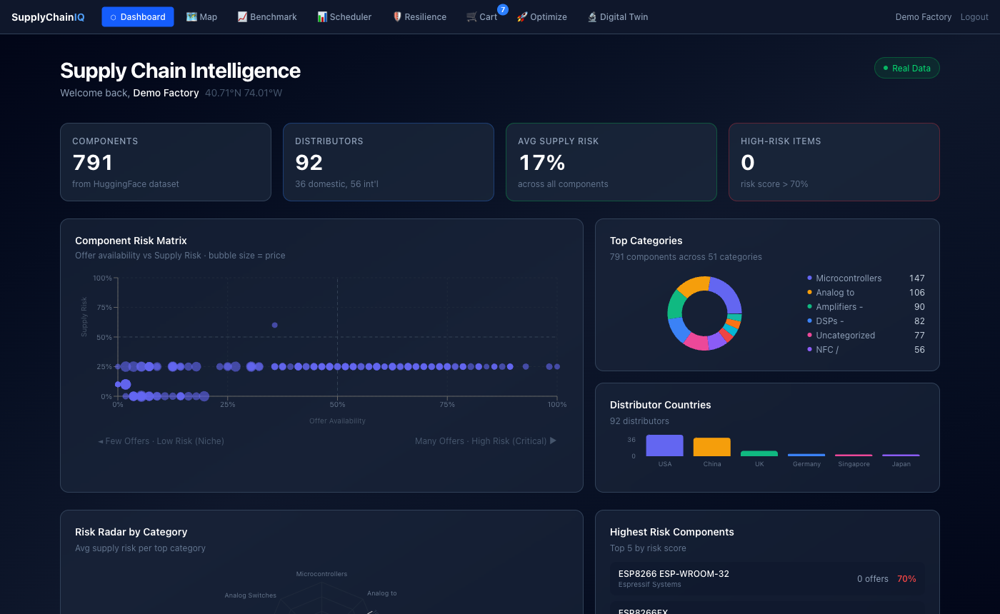
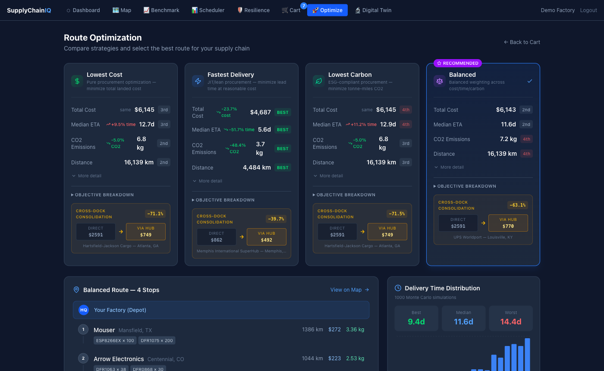
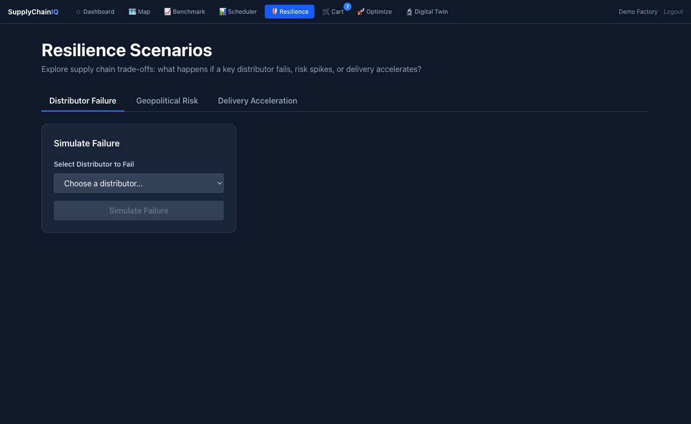

# Electronics Supply Chain Optimizer

[](https://github.com/ApagPlayz/supply-chain-optimizer/actions/workflows/ci.yml)

A full-stack supply chain intelligence platform for electronic component procurement. Built with real market data (791 components, 92 distributors, 8,731 price offers from Nexar/Octopart).

**Live demo flow:** Login → browse components → add to cart → run multi-objective VRP optimization → explore resilience scenarios.



---

## What it does

**For a PCB manufacturer sourcing a BOM of electronic components across 92 real distributors:**

| Feature | Technical approach |
|---------|-------------------|
| Supplier selection | CP-SAT MILP (OR-Tools) — minimize landed cost under stock/MOQ constraints |
| Route optimization | TSP with OR-Tools routing — PATH_CHEAPEST_ARC + Guided Local Search |
| 4 Pareto-distinct strategies | Multi-objective weighted sum (cost / time / carbon) — each provably distinct |
| Delivery uncertainty | Monte Carlo simulation (1,000 scenarios) → P10/P50/P90 ETA bands |
| Network fragility | Graph ML: Fiedler algebraic connectivity, betweenness centrality, HHI, k-core decomposition |
| Resilience scenarios | Distributor failure cascade, geopolitical risk overlay, delivery target optimization |
| Demand forecasting | Prophet + FRED macro regressors → 12-week horizon with stockout warnings |
| Live risk feeds | GPR index, ACLED conflict data, IMF PortWatch port congestion, FRED freight indices |

---

## Quick Start (no Docker required)

See **[QUICK_START.md](QUICK_START.md)** for step-by-step setup.

**TL;DR:**
```bash
# Terminal 1 — backend
cd backend && source venv/bin/activate
python -m uvicorn app.main:app --reload --port 8000

# Terminal 2 — frontend
cd frontend && npm run dev
```

Open http://localhost:5173 → click **Demo Login**.

---

## Tech Stack

**Backend:** Python 3.11 · FastAPI · SQLAlchemy · SQLite (dev) / PostgreSQL (prod) · OR-Tools · NetworkX · Prophet · scikit-learn  
**Frontend:** React 18 · TypeScript · Vite · Tailwind CSS · Recharts · Zustand  
**Algorithms:** CP-SAT MILP, TSP, Monte Carlo simulation, Spectral Graph Theory  
**Data:** Nexar/Octopart API (real component pricing), FRED, ACLED, IMF PortWatch, GPR index

---

## Architecture

```
frontend/src/
  pages/          Dashboard, Map, Scheduler, Cart, CheckoutPage, ResiliencePage, BenchmarkPage
  components/     ScenarioCard, MonteCarloChart, BOMImpactTable, DeltaCard, NavBar
  store/          Zustand: authStore, cartStore, optimizeStore
  services/api.ts Axios client for all backend endpoints

backend/app/
  api/            FastAPI routers: auth, cart, optimize, resilience, graph, feeds, forecasts
  optimization/   CP-SAT sourcing MILP, OR-Tools TSP, cross-dock facility location
  graph/          NetworkX bipartite supply graph, Fiedler curve, centrality metrics
  feeds/          Live data fetchers: GPR, ACLED, IMF PortWatch, FRED freight
  ml/             Prophet demand forecasting, sklearn lead-time prediction, FRED regime model
  cache.py        SHA256-keyed scenario cache, 1h TTL, background cleanup
  supply_chain.db SQLite — 791 components, 92 distributors, 8,731 price offers (real data)
```

---

## Screenshots

| VRP Optimization (4 strategies) | Resilience Dashboard |
|---|---|
|  |  |

---

## Key API Endpoints

```
POST /api/v1/auth/demo                       # one-click demo login
GET  /api/v1/components                      # 791 real electronic components
POST /api/v1/optimize/vrp                    # 4-strategy VRP: cheapest/fastest/greenest/balanced
GET  /api/v1/graph/metrics                   # Fiedler value, centrality, HHI, k-core
POST /api/v1/resilience/distributor-failure  # simulate distributor outage -> cost/ETA/risk delta
POST /api/v1/resilience/geopolitical-risk    # overlay GPR spike -> affected components
POST /api/v1/resilience/delivery-target      # "who can hit 14 days?" -> supplier capability list
GET  /api/v1/forecasts/all                   # Prophet 12-week demand forecast for all 791 components
GET  /api/v1/feeds/status                    # live feed status: GPR, ACLED, PortWatch, FRED
GET  /api/v1/benchmark/summary               # network resilience metrics snapshot
```

Full API reference: http://localhost:8000/docs (Swagger UI when running locally)  
Scenario API reference: [docs/SCENARIO_API.md](docs/SCENARIO_API.md)

---

## Tests

```bash
cd backend
source venv/bin/activate
pytest tests/ -q
# -> 195 passed, 3 skipped
```

Test coverage: optimization solver (sourcing, routing, cross-dock), graph metrics, ML models, resilience API, auth guards, feed integrations.

---

## Interview Narrative

See [docs/RESILIENCE_INTERVIEW_GUIDE.md](docs/RESILIENCE_INTERVIEW_GUIDE.md) for the full demo walkthrough and talking points.

**The 30-second pitch:**

> "Supply chain resilience is a graph problem. I compute Fiedler algebraic connectivity — a spectral metric — to quantify how fragile the supplier network is. DigiKey handles 40% of our component offers; if they fail, the Fiedler value drops near-zero and 12 components have no alternative source. The resilience dashboard lets you run that scenario in real time and see the cost of de-risking."

**Key talking points:**
- Fiedler value as a fragility metric (spectral graph theory applied to supply chains)
- Monte Carlo shows distribution tails, not just means — that's where supply chain risk lives
- CP-SAT produces 4 Pareto-distinct strategies because cost, time, and carbon are not scalar multiples of each other
- Live geopolitical data overlay: GPR/ACLED/PortWatch feeds inform the optimizer in real time

---

## Data Sources

| Source | What it provides |
|--------|-----------------|
| Nexar / Octopart | Real component pricing, stock levels, distributor offers (791 components, 92 distributors) |
| FRED (Federal Reserve) | Freight index, PPI, macro stress regime |
| ACLED | Conflict event counts by country (distributor risk) |
| IMF PortWatch | Port call frequency (congestion delay) |
| GPR Index | Geopolitical risk index (Chinese-origin component risk) |

---

## License

MIT
