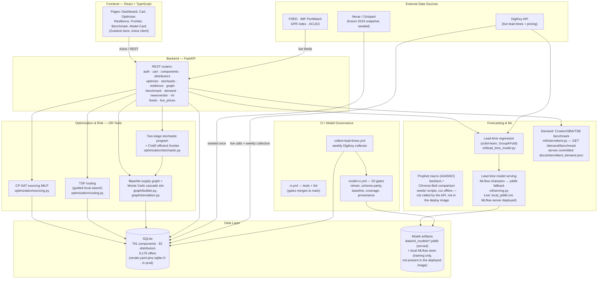

# Electronics Supply Chain Optimizer

[](https://github.com/ApagPlayz/supply-chain-optimizer/actions/workflows/ci.yml)

A full-stack supply chain intelligence platform for electronic component procurement. Built on real market data: **791 components, 92 distributors, 8,176 price offers** — a static 2024 snapshot originally collected via the Nexar API (which aggregates Octopart), redistributed on HuggingFace under CC-BY-4.0. It is real, but it is a **frozen snapshot, not a live feed** ([docs/DATA_PROVENANCE.md](docs/DATA_PROVENANCE.md)).

> ### ▶ Live demo — [supply-chain-ui-bhwz.onrender.com](https://supply-chain-ui-bhwz.onrender.com)
>
> API reference (Swagger): **[supply-chain-api-qy8x.onrender.com/docs](https://supply-chain-api-qy8x.onrender.com/docs)**
>
> No signup — the login page has a one-click **Demo Login** button.
> **The page loads instantly. The first *data* request may take 50–120 s.** Two different services sit behind those two links, and only one of them sleeps. The UI is a Render **static site** — it never spins down, and every route answers in well under a second (measured: 0.04–0.50 s, SPA rewrites included). The API is a Render **free-tier web service**, which spins down when idle, so the first call after a quiet spell waits for it to wake. The login screen says so itself: an amber *"Free-tier backend is waking up"* banner appears after 3 seconds and stays until the response lands. Once awake, the API answers in well under a second too.

**Live demo flow:** Login → browse components → add to cart → run multi-objective VRP optimization → explore resilience scenarios.


*Recorded from the live deployment above — dashboard → add to cart → optimizer results → CVaR efficient frontier → resilience scenario. Static screenshots of each page are further down.*

---

## What it does

**For a PCB manufacturer sourcing a BOM of electronic components across 92 real distributors:**

| Feature | Technical approach |
|---------|-------------------|
| Supplier selection | CP-SAT MILP (OR-Tools) — minimize landed cost under stock/MOQ constraints |
| Route optimization | TSP with OR-Tools routing — PATH_CHEAPEST_ARC + Guided Local Search |
| 4 strategies on the cost/time/carbon frontier | Multi-objective weighted sum. Distinct when the BOM is big enough to separate them — the demo cart returns **3 distinct plans across 4 strategies** — and the UI names the collapse when it happens instead of showing four cards as four answers (`strategy_divergence` in the response) |
| Delivery uncertainty | Monte Carlo simulation (1,000 scenarios) → P10/P50/P90 ETA bands |
| Network fragility | Graph ML: Fiedler algebraic connectivity, betweenness centrality, HHI, k-core decomposition |
| Resilience scenarios | Distributor failure cascade, geopolitical risk overlay, delivery target optimization |
| Demand-method benchmark | Croston/SBA/TSB scored on CRPS + scaled pinball loss, not just MASE, across 2,646 Monash car-parts series — MASE and proper scoring pick different winners |
| Live risk feeds | GPR index, ACLED conflict data, IMF PortWatch port congestion, FRED freight indices |

---

## I audited my own headline and retracted it

The benchmark used to claim the optimizer was **44.7% cheaper than a greedy buyer**.
That number is arithmetically correct and substantively meaningless, so rather than
quietly deleting it, here is the decomposition.

The greedy baseline buys each BOM line from whoever is cheapest, which makes it the
**component-cost minimum by construction** — the MILP *cannot* beat it on component
cost. It can only win on fixed charges. And every distinct supplier you open costs a
flat **$75** (LTL) or **$150** (air) freight fee. Now look at the scale the benchmark
ran at:

| `iot_sensor_node`, as benchmarked (4 parts, 5 units) | |
|---|---:|
| Component cost | **$6.96** |
| Fixed freight fees | **$450.00** |
| Variable freight + consolidation | $11.02 |
| Total "landed cost" | $467.98 |

**Fixed fees are 96.2% of the cost being optimized.** Consolidating 3 suppliers into 1
avoids $337.50 of fees and books a **71.7% saving** — on a *seven-dollar* order.

Aggregated across all 10 BOMs (pooled: sum of greedy costs vs sum of MILP costs), the
decomposition is damning:

| Source of the $3,304 "saving" at benchmark scale | |
|---|---:|
| Avoided fixed per-supplier fees | **+$3,863** |
| Variable freight | +$2 |
| **Component cost** | **−$561** ← *the MILP pays **more** for the parts* |

**Fixed fees are 117% of the saving.** The MILP loses on component cost in **10 of 10**
BOMs — it must, since greedy is the component-cost minimum — and funds that loss, plus
the entire headline, out of avoided supplier fees.

That saving is a **constant** (`$112.50–$225 per supplier avoided`, after the 1.5×
`transport_penalty_scale`), not a rate — so as volume grows, only the denominator moves:

| Volume | Savings vs greedy (pooled) |
|---|---:|
| 4–9 units *(as benchmarked)* | **47.2%** |
| ~50 units | 23.1% |
| ~500 units | 8.5% |
| ~5,000 units | 5.0% |
| 2,000–60,000 units *(500×–10,000×)* | **2.6% – 8.0%** |

(`iot_sensor_node`, the BOM that books **71.7%** at prototype scale, goes **71.7% → 7.4%** on its own.)

**The 45% headline is dead. Do not quote it.** At any volume a real manufacturer would
order, the cost edge is single digits.

### The audit found a real bug — and fixing it cut *against* the retraction

Chasing that decaying curve turned up a genuine defect in the freight model: it computed
one representative shipment weight for the whole BOM and then charged **every** opened
supplier that full weight, so splitting an order across 3 suppliers was billed 3× a full
BOM's variable freight instead of dividing one BOM's freight across 3 shipments. It
corrupted **both** arms (they share the cost function by design), and it made distance
almost free at volume.

Freight is now `fixed[d]·opened(d) + per_unit[d]·units_shipped_from(d)` — still linear,
so CP-SAT models it exactly. And the corrected model makes the optimizer look **better**
at scale, not worse: the fixed-fee wedge collapses to zero (at ≥500× the MILP opens
*more* suppliers than greedy on purpose), and the residual 2.6–8.0% edge comes from
**routing volume by price + freight** rather than by unit price alone — something greedy
structurally cannot do. That part scales with volume and is honestly earned.

Reporting a correction that helps my own number is the same discipline as reporting one
that hurts it.

What the optimizer genuinely provides beyond that: *feasibility and flexibility* — it
respects MOQ and stock (the greedy baseline cheerfully orders 2,500 units from an offer
holding 1), it can split a line across distributors, and it proves optimality on the
cost/time/carbon tradeoff.

Full decomposition, methodology and the reproduce script:
**[docs/BENCHMARK_VOLUME_CURVE.md](docs/BENCHMARK_VOLUME_CURVE.md)**.

> Auditing this also surfaced a genuine production bug: `sourcing.py` keyed its CP-SAT
> variables on `(component, distributor)` while the offer table stores one row per
> price-break tier, so 509 duplicated pairs were being summed into the demand constraint
> and priced into the objective. `STM32F103C8T6` from Verical was costed at **$30.03/unit
> against a true $2.86**, so the solver had been systematically avoiding multi-tier
> distributors. Fixed, with regression tests.

---

## Dollar-denominated impact

Every headline metric is paired with a concrete financial interpretation, derived
from real computed quantities — never an invented figure. The conversions are
surfaced live in the dashboard (resilience banner, benchmark strip, holding-cost
tooltips) and summarized here.

| Metric | Where it comes from | Dollar translation |
|--------|---------------------|--------------------|
| **CVaR-95** (tail-risk) | Mean emergency-procurement cost multiplier over the worst-5% of 1,000 Monte Carlo cascade scenarios (`graph/simulation.py`) | **"$X of procurement spend at risk"** = real baseline BOM spend × (CVaR-95 − 1). Computed per BOM in `resilience.py` (`procurement_spend_at_risk_usd`) and shown on the Resilience page; aggregated per reference BOM on the Benchmark page (`baseline_spend_at_risk_usd`). **Caveat — read this before trusting the number:** the *spend* side is real, and the *probability* side is now calibrated, not proxied. Distributor failure probability is anchored to a cited base rate — McKinsey Global Institute (Aug 2020): disruptions lasting a month or longer roughly every 3.7 years — converted to an annual Poisson rate and then to a probability over a 60-day purchase-order exposure window; betweenness centrality only rank-orders *relative* risk around that base rate (a `centrality_spread=1.0` sensitivity arm removes centrality's effect entirely), and every probability is capped at 50%. On the live headline BOM this puts calibrated `p_fail` between 1.45% and 13.04% across its six suppliers — it no longer saturates near a fixed number. What's still assumed, not measured: the McKinsey rate is firm-level, so applying it to one distributor is almost certainly too high, and nothing establishes that centrality actually predicts disruption likelihood (the code names this and ships the `spread=1.0` arm precisely because of it). See [docs/CVAR_EFFICIENT_FRONTIER.md](docs/CVAR_EFFICIENT_FRONTIER.md). |
| **Optimizer cost delta** | Graph-aware MILP vs blind MILP total landed cost, over the **9 of 10** reference BOMs the run actually scores (`benchmark.py`). `audio_dsp_board` is excluded because the blind arm raises `Sourcing MILP infeasible (status=INFEASIBLE)` on it; the exclusion and its reason are recorded in `bom_inclusion` in [docs/benchmark_results.json](docs/benchmark_results.json), and `/benchmark/summary` reports `n_boms: 9` | **"$Y per BOM run"** = mean(graph-aware − blind `total_cost_usd`), served live as `cost_delta_usd`. Surfaced as a real, run-dependent figure rather than a fixed claim — and on the current reference set **it is a cost, not a saving**: graph-aware runs **+$59.99 (+31.0%) more expensive** per BOM. The Benchmark page prints exactly that ("nominal cost premium … $59.99 more expensive / BOM run") and says it is *the price of the resilience below, not a reversal of the optimization result*. Note the 2% materiality threshold this is measured against is a reporting convention fixed a priori — the API states in `materiality_threshold_basis` that it is **not** a measured noise floor, because the benchmark is a single deterministic solve (seed 42, one search worker) with no replicates from which run-to-run variance could be estimated. |
| **Forecast WAPE** (macro backtest, kept) | Walk-forward backtest (3 rolling origins, 12-month horizon) on Census M3 `A34SNO` (Manufacturers' New Orders: Computers & Electronic Products), 198 monthly obs, **pinned to ALFRED vintage 2026-08-16**: Prophet **3.13%** vs seasonal-naive **4.80%** — skill score **+34.8%**. Under the **real-time protocol** — each origin trained only on the vintage that existed on its date, because Census revises this series *in place* — Prophet is **4.13%** vs naive **5.87%**, skill **+29.6%**. The revised-data figures are optimistic by ~24%; the real-time pair is the number you could actually have achieved, and it is the one to quote ([docs/FORECAST_BACKTEST.md](docs/FORECAST_BACKTEST.md)) | **No dollar translation.** This number used to feed a "≈N weeks of safety stock" tooltip on a per-part forecast — that forecast is gone (its magnitude was `total_stock/52 × risk_score`, inferred from inventory, not measured), and the safety-stock dollar figure went with it rather than being carried over with no live consumer. The macro WAPE above is real and stands on its own as a Prophet-vs-naive comparison on an aggregate industry series; it says nothing about per-part accuracy. **What now measures demand-forecast quality:** an intermittent-demand method benchmark on 2,646 Monash car-parts series — MASE ranks the degenerate `zero` forecast 1st (mean rank 1.66) while proper scoring ranks it 4th on CRPS / 5th on scaled pinball loss, and `tsb` wins both (Friedman p < 1e-300). See [docs/INTERMITTENT_DEMAND.md](docs/INTERMITTENT_DEMAND.md). That benchmark doesn't translate to dollars yet — connecting it to the sourcing decision is open work ([docs/archive/ML_API_PUSH_PLAN.md](docs/archive/ML_API_PUSH_PLAN.md) §1.4). |

### Conversion assumptions & citations

- **Inventory carrying cost = 25%/yr.** Reused from the existing optimizer constant
  `ANNUAL_HOLDING_RATE = 0.25` (`backend/app/optimization/costs.py`), cited to
  **Gartner IT Supply Chain Benchmarks 2022** (electronics annual holding rate). The
  same rate already drives the per-route holding cost shown at checkout. Industry
  ranges are typically 20–25%/yr (Richardson, *Harvard Business Review*; APICS).
- **Service level z = 1.645** (95%, one-sided normal) for the safety-stock buffer.
  WAPE is used as a σ/μ forecast-error proxy over the planning horizon — a standard
  textbook safety-stock framing (Silver, Pyke & Peterson, *Inventory Management and
  Production Planning*).
- **CVaR-95 → dollars: the spend side is real, and the probability side is now
  calibrated against a cited base rate — precisely which parts, and which parts
  are still assumed.** The *spend* side is real: it multiplies by the real BOM
  spend (sum of each line's average real offer price). The *probability* side
  (`optimization/stochastic.py`) starts from McKinsey Global Institute (Aug 2020):
  "companies can now expect supply chain disruptions lasting a month or longer to
  occur every 3.7 years," treated as a Poisson rate and converted to a probability
  over the 60-day purchase-order exposure window. Betweenness centrality
  (`graph/simulation.py`) only rank-orders *relative* risk around that calibrated
  base rate — the most central supplier gets `spread`× it, the least central gets
  1/`spread`×, capped at 50% — and `centrality_spread=1.0` (centrality ignored
  entirely) is a supported, published sensitivity arm. On the live headline BOM
  this gives calibrated `p_fail` of 1.45%–13.04% across the six suppliers, not a
  saturated constant. What's still an assumption, not a measurement: the McKinsey
  rate is firm-level, not per-supplier, so applying it to a single distributor is
  almost certainly too high; and nothing establishes that centrality actually
  predicts disruption likelihood at all (arguable either way — the code names this
  explicitly and ships the `spread=1.0` arm because of it). Earlier drafts of this
  README called the pre-calibration version "fully data-derived," which was an
  overstatement that was corrected; this is the current, calibrated state.

### What this model can't do

Stated up front, because an interviewer will find these anyway and it is better that
they hear it from me:

- **There is no per-part demand forecast in this app, and there wasn't a good one
  before.** It used to compute `total_stock / 52 × risk_score` and call the result
  "demand," then fit Prophet on top — a magnitude *inferred from inventory position
  and a risk multiplier*, not measured, and identical in shape across all 791 parts.
  The forecast window it produced also closed 17 months before this line was
  written, against which no actuals were ever recorded — unscoreable even in
  principle. It was removed rather than patched (migration
  `0008_drop_synthetic_demand_tables.py`), because no public per-SKU demand series
  exists for electronic components. The Census `A34SNO` backtest above is real and
  unaffected by the deletion — it never depended on those tables — but it measures
  an aggregate industry series, not this app's parts, so the 3.13% WAPE (4.13%
  under the real-time protocol) is still not evidence about per-part accuracy.
  What replaced the per-part claim is a method
  benchmark on a real intermittent-demand panel (Monash car parts) — see the
  demand-method row above and [docs/INTERMITTENT_DEMAND.md](docs/INTERMITTENT_DEMAND.md).
- **Disruption probabilities are structural, not empirical** (see the CVaR caveat above).
- **The lead-time panel is 2,664 real observations across five snapshot dates**
  (75 on 2026-07-01, 742 on 2026-08-15, 363 on 2026-08-17, 742 on 2026-08-24, 742 on
  2026-08-31), all from DigiKey — one distributor, not a cross-distributor consensus. 791
  of 791 parts were polled on 2026-08-15; 6.2% missed (43 not in DigiKey's catalog, 6 in
  the catalog with no published lead time), and that miss list is in
  `seeds/data/lead_time_panel/collection_log.csv`.
- **The served lead-time model is an older vintage than the panel, on purpose and in the
  open.** The collector runs weekly; the model is retrained by hand. The deployed artifact
  was trained **2026-08-24** on the **1,879** usable rows of the then-1,922-row,
  four-snapshot panel, with **263** features — every `1,879` / `472` / `28` / `263` figure
  below describes *that artifact*, not the panel on disk. The 2026-08-31 snapshot is data
  the served model has never seen, so **a retrain is owed**.
  `GET /api/v1/ml/model-info` publishes both sides: the training count, and a
  `training_data_staleness` block that compares the panel sha256 the artifact recorded at
  fit time (`0884a977…`) with the file on disk (`c68e2891…`). It currently reports
  `stale: true` and names the retrain command. The tripwire is deliberately a warning and
  not a build failure, so a scheduled collector commit cannot turn CI red by itself.
- **Any lead-time R² must come from a *grouped* split, not a random one.** The dataset
  contains large near-duplicate part families (200 STM32F103 variants, 74 ATMEGA328),
  and `base_product` alone explains **R²=0.848 of the target in sample** (361 levels
  over 1,879 rows — an in-sample identity-column figure, not a model score and not
  cross-validated). A random split therefore scores memorization of a part family, not
  prediction. Measured over 50 folds — same estimator, same 1,879 rows, same feature
  pipeline, only the grouping changes (all four figures below are properties of the
  **2026-08-24 artifact vintage** described above — 1,879 rows, 4 snapshots — not of the
  2,664-row panel now on disk):

  | Split regime | R² mean | R² median |
  |---|---:|---:|
  | random rows (**the wrong protocol**) | **+0.804** | +0.810 |
  | `GroupKFold` by part family (**472 family grouping keys**) | **+0.084** | +0.183 |
  | `GroupKFold` by manufacturer | **−0.784** | −0.105 |

  The effective sample size for generalization is **28 manufacturers, not 1,879 rows**.
  A negative R² on held-out manufacturers means the model's squared error exceeds
  that vendor's whole label variance — no explanatory power at all on a vendor it has
  never quoted. The family split groups on the same `_group_key` the shipped model
  uses — `base_product` where it exists, MPN or row otherwise — which is **472
  grouping keys**, not the 361 raw `base_product` levels quoted above for the
  in-sample identity check; the two numbers count different things and both come from
  `docs/leakage_progression.json` (`counts.n_family_group_keys` = 472,
  `identity_column_in_sample_r2.base_product.n_levels` = 361) and from the served
  `metrics.joblib['lead_time_leakage_audit']['n_families']` = 472. Grouped by part
  family is the only split I would defend, and even that one is optimistic relative to
  how the model is deployed. (An earlier revision
  of this table quoted an 810-row, 27-manufacturer, `random_forest` vintage — R²
  +0.638 / +0.082 / −0.550 — that two retrains had already superseded by 2026-08-26;
  those numbers are retired.) The served artifact
  (`metrics.joblib['lead_time_leakage_audit']`, 20 repeated `GroupShuffleSplit`
  holdouts rather than 50 `GroupKFold` folds) reports the same collapse on the same
  1,879 rows: +0.8084 → +0.1169 → **−0.3895**, and that is the figure
  `GET /api/v1/ml/model-comparison` serves. Full protocol, per-fold scores and the
  naive baselines on identical folds:
  [docs/LEAKAGE_PROGRESSION.md](docs/LEAKAGE_PROGRESSION.md) /
  [docs/leakage_progression.json](docs/leakage_progression.json), regenerated with
  `cd backend && python -m seeds.run_leakage_progression`.
- **Prices are a frozen 2024 snapshot**, so nothing here reflects today's market.

See [docs/IMPACT_FRAMING.md](docs/IMPACT_FRAMING.md) for the full derivations.

---

## Quick Start (no Docker required)

Nothing to install if you just want to look: use the **[live demo](https://supply-chain-ui-bhwz.onrender.com)** above.
To run it locally, see **[QUICK_START.md](QUICK_START.md)** for step-by-step setup.

**TL;DR:**
```bash
# Terminal 1 — backend
cd backend && source venv/bin/activate
python -m uvicorn app.main:app --reload --port 8000

# Terminal 2 — frontend
cd frontend && npm run dev
```

Open http://localhost:5173 → click **Demo Login**.

---

## Tech Stack

**Backend:** Python 3.11 · FastAPI · SQLAlchemy · SQLite (dev **and** current production — `render.yaml` pins `DATABASE_URL=sqlite:///./supply_chain.db`; PostgreSQL support exists in the SQLAlchemy layer via `psycopg`, but nothing is deployed on it) · OR-Tools · NetworkX · scikit-learn (Prophet is installed and used by the offline `seeds/` backtests; no API route imports it)  
**Frontend:** React 19 · TypeScript · Vite · Tailwind CSS v4 · Recharts · Zustand · MapLibre GL + deck.gl (map)  
**Algorithms:** CP-SAT MILP, TSP, Monte Carlo simulation, Spectral Graph Theory  
**Data:** Nexar/Octopart static 2024 snapshot (real component pricing), DigiKey API (2,664 real observed lead times + live pricing), Nexar & OEMsecrets live pricing, FRED, IMF PortWatch, GPR index (all live), ACLED (needs a key — reports as inactive without one)

---

## Architecture

```
frontend/src/
  pages/          Dashboard, Map, Scheduler, Cart, Checkout, Resilience, Benchmark, Frontier,
                  Newsvendor, ModelCard, Login, Register, NotFound
  components/     NavBar, ScenarioCard, DeltaCard, MonteCarloChart, BOMImpactTable, CiStrip,
                  BomCostBreakdownTable, CriticalitySweepTable, DualSourcingTable, TornadoChart,
                  VolumeDecayCurve, DistributorSelector, ErrorBoundary, map/
  store/          Zustand: authStore, cartStore, optimizeStore
  services/api.ts Axios client for all backend endpoints
frontend/scripts/
  ui-gate.cjs     the automated browser gate — 239 checks against the live site (see Tests)

backend/app/
  api/            FastAPI routers: auth, cart, components, distributors, optimize, stochastic,
                  resilience, graph, benchmark, demand, newsvendor, ml, feeds, live_prices
  optimization/   CP-SAT sourcing MILP, OR-Tools TSP, cross-dock facility location
  graph/          NetworkX bipartite supply graph, Fiedler curve, centrality metrics
  feeds/          Live data fetchers: GPR, ACLED, IMF PortWatch, FRED freight
  ml/             Prophet macro (A34SNO) backtest + Chronos comparison, sklearn lead-time
                  prediction, FRED regime model, intermittent-demand method benchmark
                  (Croston/SBA/TSB, shared rolling-origin protocol)
  cache.py        SHA256-keyed scenario cache, 1h TTL, background cleanup
  supply_chain.db SQLite — 791 components, 92 distributors, 8,176 price offers (real data)
```


```mermaid
flowchart TB
    subgraph FE["Frontend — React + TypeScript"]
        UI["Pages: Dashboard, Cart, Optimizer,<br/>Resilience, Frontier, Benchmark, Model Card<br/>(Zustand store, Axios client)"]
    end

    subgraph BE["Backend — FastAPI"]
        API["REST routers:<br/>auth · cart · components · distributors<br/>optimize · stochastic · resilience · graph<br/>benchmark · demand · newsvendor · ml<br/>feeds · live_prices"]
    end

    subgraph OPT["Optimization & Risk — OR-Tools"]
        SOURCING["CP-SAT sourcing MILP<br/>optimization/sourcing.py"]
        ROUTING["TSP routing<br/>(guided local search)<br/>optimization/routing.py"]
        STOCH["Two-stage stochastic program<br/>+ CVaR efficient frontier<br/>optimization/stochastic.py"]
        GRAPHSIM["Bipartite supply graph +<br/>Monte Carlo cascade sim<br/>graph/builder.py, graph/simulation.py"]
    end

    subgraph ML["Forecasting & ML"]
        LEADTIME["Lead-time regression<br/>(scikit-learn, GroupKFold)<br/>ml/lead_time_model.py"]
        DEMAND["Demand: Croston/SBA/TSB benchmark<br/>ml/intermittent.py — GET /demand/benchmark<br/>serves committed docs/intermittent_demand.json"]
        OFFLINE["Prophet macro (A34SNO) backtest +<br/>Chronos-Bolt comparison<br/>seeds/ scripts, run offline —<br/>not called by the API, not in the deploy image"]
        SERVING["Lead-time model serving<br/>MLflow champion → joblib fallback<br/>ml/serving.py<br/>Live: local_joblib (no MLflow server deployed)"]
    end

    subgraph DATA["Data Layer"]
        DB[("SQLite<br/>791 components · 92 distributors<br/>8,176 offers<br/>(render.yaml pins sqlite:/// in prod)")]
        ARTIFACTS[("Model artifacts<br/>data/ml_models/*.joblib (served)<br/>+ local MLflow store (training only,<br/>not present in the deployed image)")]
    end

    subgraph EXT["External Data Sources"]
        NEXAR["Nexar / Octopart<br/>(frozen 2024 snapshot, seeded)"]
        DIGIKEY["DigiKey API<br/>(live lead times + pricing)"]
        MACRO["FRED · IMF PortWatch<br/>GPR index · ACLED"]
    end

    subgraph CICD["CI / Model Governance"]
        CI["ci.yml — tests + lint<br/>(gates merges to main)"]
        MODELCI["model-ci.yml — 50 gates<br/>retrain, schema parity,<br/>baseline, coverage, provenance"]
        COLLECTOR["collect-lead-times.yml<br/>weekly DigiKey collector"]
    end

    UI -->|Axios / REST| API
    API --> SOURCING
    API --> ROUTING
    API --> STOCH
    API --> GRAPHSIM
    API --> LEADTIME
    API --> DEMAND
    STOCH --> GRAPHSIM
    SOURCING --> DB
    ROUTING --> DB
    GRAPHSIM --> DB
    API --> DB
    LEADTIME --> SERVING
    SERVING --> ARTIFACTS
    NEXAR -->|seeded once| DB
    DIGIKEY -->|live calls + weekly collection| DB
    DIGIKEY --> LEADTIME
    MACRO -->|live feeds| API
    COLLECTOR --> DB
    COLLECTOR --> MODELCI
    MODELCI --> ARTIFACTS

    classDef offline stroke-dasharray: 5 5;
    class OFFLINE offline;
```

Every ML training run is tracked with MLflow (params, real backtest metrics, model artifacts, champion promotion) — see [docs/MLFLOW.md](docs/MLFLOW.md).

---

## Screenshots

Both are captures of the **live deployment** at `85b2890`, taken from the demo cart a
one-click Demo Login gives you (5 lines, 225 units). Every figure in them is a field of
the response the API actually returned; you can reproduce either one in about a minute.

### `/optimize` — four strategies, three genuinely distinct plans


The trade-off is the point: **$374.02 / 6.9 d / 89.6 kg** buys everything from one cheap
Singapore distributor, and **$747.44 / 4.5 d / 1.49 kg** splits it across three domestic
suppliers — roughly **2× the cost for 2.4 days and 60× less carbon**. Lowest Carbon holds
a third, distinct position (**$735.01 / 5.5 d / 0.849 kg**).

Note the amber banner. Two of the four strategies (Fastest Delivery and Balanced) return
the *same* plan on this BOM, and the page says so out loud rather than presenting four
cards as four answers — the strategies are ranked only where they actually differ, and
`strategy_divergence.distinct_plans` in the response is the number the banner prints.

### `/resilience` — losing the distributor the cart leans on


The scenario fails the distributor four of the five cart lines are sourced from. Cost
rises **28.5%** ($167.61 → $215.33), modelled fulfilment falls **100% → 80%**, the risk
score goes **0.220 → 0.420**, and CVaR-95 procurement spend at risk is **$9.01**.

The ETA *improves* (26.6 → 23.4 days) and the page explains why instead of hiding it: the
ETA is the slowest line of the plan priced beside it, and the cheap Singapore supplier is
also the distant one, so being forced onto the next-cheapest surviving offer lands the BOM
sooner while costing more. Note also that **no** BOM line is orphaned — and the banner
refuses to let that read as "no impact", because the Monte Carlo cascade in the same
response still moves median fulfilment 20 points.

---

## Key API Endpoints

```
POST /api/v1/auth/demo                       # one-click demo login
GET  /api/v1/components                      # 791 real electronic components
POST /api/v1/optimize/vrp                    # 4-strategy VRP: cheapest/fastest/greenest/balanced
GET  /api/v1/graph/metrics                   # Fiedler value, centrality, HHI, k-core
POST /api/v1/resilience/distributor-failure  # simulate distributor outage -> cost/ETA/risk delta
POST /api/v1/resilience/geopolitical-risk    # overlay GPR spike -> affected components
POST /api/v1/resilience/delivery-target      # "who can hit 14 days?" -> supplier capability list
GET  /api/v1/demand/benchmark                # intermittent-demand method benchmark (Croston/SBA/TSB, CRPS+MASE, Monash car parts)
GET  /api/v1/feeds/status                    # live feed status: GPR, ACLED, PortWatch, FRED
GET  /api/v1/benchmark/summary               # network resilience metrics snapshot
```

Full API reference (live Swagger UI): **https://supply-chain-api-qy8x.onrender.com/docs** — or http://localhost:8000/docs when running locally  
Scenario API reference: [docs/archive/SCENARIO_API.md](docs/archive/SCENARIO_API.md)

---

## Tests

### Backend

```bash
cd backend
./venv/bin/python -m pytest tests/ -q
# -> 2 failed, 1120 passed, 3 skipped, 1 xfailed, 476 warnings in 757.59s (0:12:37)
```

That is the output of a real run on `85b2890`, 2026-09-02 — not a rounded figure. **Two
tests fail, both on purpose, and both are named here rather than buried:**

| Failing test | Why, and what it means |
| --- | --- |
| `test_model_ci_gates.py::test_the_served_estimator_is_the_one_the_metrics_describe` | A **local-environment** artifact. It asserts that the estimator answering predictions is the one `metrics.joblib` describes, and that identity resolves through whichever MLflow store is reachable at import time on the machine running the suite. Locally the store resolves to no match (`assert [] == ['gradient_boosting']`); **in CI it passes**. This is the one permitted failure and it is not to be "fixed" by weakening the assertion. |
| `test_artifacts_pinned_to_code.py::test_leakage_progression_reproduces_from_the_live_lead_time_model` | A **real, open piece of work**, and the test is doing exactly its job. It refuses to compare published leakage numbers against a panel that has moved underneath them: `observed_lead_times.csv` now hashes to `c68e2891…` while `docs/leakage_progression.json` was generated from `0884a977…`. The weekly collector's 2026-08-31 commit added a fifth snapshot, so **a retrain and an artifact regeneration are owed** (`cd backend && ./venv/bin/python -m seeds.run_leakage_progression`, ~215 s). Until that lands, the test is red — which is the correct behaviour, and the same fact the lead-time bullets above and `GET /api/v1/ml/model-info` already publish. |

A suite that reports "1120 passed" and hides two reds would be worse than this. Neither
failure is a defect in shipped behaviour; one is environmental and one is a to-do the
gate is correctly refusing to let go quiet.

Coverage: optimization solver (sourcing, routing, cross-dock), graph metrics, ML models
and their published-artifact pins, resilience API, auth guards, feed integrations.

### Frontend

The frontend **does** have an automated test suite. It is a browser gate, not a unit-test
runner, and it runs against the **live deployment**:

```bash
cd frontend
BASE=https://supply-chain-ui-bhwz.onrender.com npm run ui-gate
# -> 239 passed, 0 failed
```

Also a real run, 2026-09-02, against `85b2890`. `scripts/ui-gate.cjs` drives a real
Chromium over **all 10 routes at 4 viewports** (390 / 768 / **1280** / 1440 — 1280 is
there because a nav regression lived exactly at that breakpoint) and asserts what a human
would otherwise have to notice:

- **horizontal overflow**, measured against the real scroll container — every route renders
  inside `overflow-y-auto`, so `document.scrollWidth` reports a false clean
- **clipped SVG chart labels** — `scrollWidth > clientWidth` never fires on SVG text, which
  is how three clipped axis labels shipped unnoticed
- **chart geometry** (the tallest bar must clear 8px) and **legend-vs-axis-label overlap**
- **chart legend contrast**, hand-rolled by compositing alpha through a 1px canvas, because
  axe-core returns *incomplete* rather than a violation for recharts legend labels
- **axe-core serious/critical** — and deliberately *not* hand-rolled contrast for Tailwind
  colours: Tailwind v4 emits `oklch()`, and a naive rgb parser returned a false clean on 32
  real failures
- **leaked JS placeholders** in user-visible text, **text under 11px** (prose under 12px),
  **touch targets ≥ 44px** (with WCAG 2.5.5's inline-link exemption), emoji in product UI,
  **head tags**, and **console/page errors**
- a route rendering the 404 page **fails** — a missing route trivially passes every other
  check, so without this the gate reports a clean sheet on a dead page

Type-checking and the production build:

```bash
cd frontend
npx tsc -b --force && npm run build
```

> **Use `tsc -b`, never `tsc --noEmit`.** The root `tsconfig.json` is a *solution* file
> (`"files": []` plus `references`), so `tsc --noEmit` typechecks **nothing** and exits 0 on
> any error. Verified again on 2026-09-02 by planting `const x: number = "not a number"` in
> `src/pages/NotFoundPage.tsx`: `npx tsc --noEmit` exited **0**, `npx tsc -b --force`
> reported `error TS2322`. `npm run build` uses `tsc -b`, which is why CI catches what a
> bare `--noEmit` would wave through.

---

## Model CI — gates derived from bugs that actually shipped

A second workflow, [`model-ci`](.github/workflows/model-ci.yml), asks a different
question from `ci.yml`: not *"does the code work?"* but *"is the model fit to
serve?"*. It retrains the lead-time model on the committed observed panel and
fails the build on any of the following. **Every gate is a postmortem, not a best
practice** — each one names a defect that was live in this repo and was found by
hand, never by a test:

| Gate | The bug it prevents |
| --- | --- |
| **Train/serve schema parity** | Training and serving built different feature schemas; the aligner zero-filled the difference, so **every** prediction was the constant 62.1085 days — while `/ml/model-comparison` published R²=0.9291 for a configuration that was never served. |
| **Beats its stated baseline** | `beats_baselines` was computed and the model was persisted regardless of the answer. The regime model shipped at 0.733 accuracy against a 0.833 persistence baseline. Now a losing model is refused *and* any stale artifact is deleted. |
| **Serve-time coverage floor** | Feature admission asked "does this column exist?" instead of "is it ever populated?". Two columns filled on 7.0% of rows were admitted, and the model then declined to predict on 93% of real inputs — false on 6 of 6 sampled optimizer runs. Now ≥80% of real `(offer, component)` pairs must get an answer, measured against the shipped database. |
| **Not a near-constant predictor** | The other half of the schema bug, and the reason it survived: nothing ran the committed artifact over real inputs and measured the spread. Now it does. |
| **Endpoint declares its model's inputs** | The schema grew a `parameter_count` requirement, the `/ml/lead-time` signature did not follow, and FastAPI returned **422 on every call** before the model was consulted. |
| **Artifact carries provenance** | `metrics.joblib` had no `trained_at`, no training-data hash, no row count, no git SHA — so which data produced which model was unanswerable, which is why the R² mismatch went unnoticed. |
| **A gate can't silently stop testing** | A contract test kept passing while testing nothing, because the primary feature was renamed underneath it. Meta-tests now assert the variance tests still vary the model's *actual* primary feature — and `MODEL_CI_STRICT=1` turns a **skipped** gate into a failure, because a skipped gate is a green gate. |

Provenance (`trained_at`, `git_sha`, `sklearn_version`, `training_data_sha256`,
`n_training_rows`, `n_distinct_families`, …) is stamped at fit time and published
at `GET /api/v1/ml/model-info`. A **staleness check** warns — never fails — when
the weekly collector has grown the panel past what the served artifact was
trained on, so that growth is visible rather than silently ignored.

```bash
cd backend
MODEL_CI_STRICT=1 ./venv/bin/python -m pytest tests/ -m model_ci -q
# -> 1 failed, 50 passed, 1092 deselected, 1 xfailed in 155.55s (0:02:35)
```

51 gates plus one `xfail`. The single red is
`test_the_served_estimator_is_the_one_the_metrics_describe` — the same permitted
local-only MLflow identity check described under [Tests](#tests), green in CI.

Full write-up, including what these gates deliberately do **not** claim:
**[docs/MODEL_CI.md](docs/MODEL_CI.md)**.

---

## Lint & type-check

CI runs a dedicated `backend-lint` job (ruff + mypy) alongside tests, plus `tsc -b`
for the frontend (part of `npm run build`). Config lives in `backend/pyproject.toml`.

```bash
cd backend
source venv/bin/activate
pip install -r requirements-dev.txt   # ruff + mypy, dev-only

ruff check app          # lint (E/F/I/UP/B core rules)
ruff format app --check # formatting — not yet wired into CI (see note below)
mypy app                 # type-check (non-strict)
```

Both `ruff check app` (`All checks passed!`) and `mypy app` (`Success: no issues found in 77 source files`) are green today — re-run 2026-09-02. Deliberately deferred, tracked
in `pyproject.toml` comments so they can be picked up later without fighting
in-flight edits elsewhere in the repo:

- **`ruff format`**: **69 of 77** backend files would be reformatted (`ruff format app
  --check`) — the codebase predates a formatter convention. Not added as a CI gate yet:
  running it would touch nearly every file. Run locally and land as its own PR when
  convenient.
- **Typing-modernization rules** (`UP006`, `UP035`, `UP037`, `UP045` — `List`/`Optional[X]`
  → `list`/`X | None`) and **import sorting** (`I001`): large, repo-wide, low-risk-but-
  noisy sweeps. Ignored in `[tool.ruff.lint]` for now; safe to re-enable and `--fix`
  once other in-flight branches land.
- **Eight per-file rule ignores**, in `app/ml/regime_model.py` (`F401`, `B905`),
  `app/ml/lead_time_model.py` (`E402`), `app/ml/serving.py` (`UP017`),
  `app/optimization/recommendations.py` (`F401`), `app/optimization/solve.py` (`F841`),
  `app/optimization/sourcing.py` (`F841`), `app/graph/simulation.py` (`B905`) and
  `app/core/clients/oemsecrets_client.py` (`B007`) — small, real lint findings (unused
  imports and locals, `zip()` without `strict=`, an import below the top of the module,
  an unused loop variable, and `datetime.timezone.utc` where `datetime.UTC` now exists),
  left untouched because those files are owned by concurrent work; see
  `[tool.ruff.lint.per-file-ignores]`.
- **mypy** is fully strict-by-default-off (`ignore_missing_imports`, no `--strict`) and
  has a `[[tool.mypy.overrides]]` block that turns off checking for **22** modules — mostly
  `app/api/*` and `app/optimization/*` — where the codebase's untyped SQLAlchemy
  `Column(...)` declarative models (no `Mapped[...]` annotations) produce large numbers
  of `Column[T]` vs `T` false positives rather than real bugs. `mypy app` reports
  `Success: no issues found in 77 source files`, so **55 of those 77** are fully
  type-checked today. Migrating `app/models/*` to SQLAlchemy 2.0 `Mapped[]` typing would
  let those overrides be removed.

---

## Interview Narrative

See [docs/RESILIENCE_INTERVIEW_GUIDE.md](docs/RESILIENCE_INTERVIEW_GUIDE.md) for the full demo walkthrough and talking points.

**The 30-second pitch:**

> "Supply chain resilience is a graph problem, so I measured it spectrally — and the
> measurement talked me out of my own thesis. I expected one dominant distributor and a
> network one failure from collapse. What the data actually says: DigiKey is the largest
> single distributor at **11.2%** of offers, not 40%; killing DigiKey outright orphans
> **zero** components and moves landed cost by **~0%**, because the per-line redundancy
> is genuinely there. The whole-graph Fiedler value is exactly 0.0 — but that's a floor
> by construction, since the graph fragments into 43 components. The number that means
> something is λ₂ = **0.238** on the giant component, which holds **95%** of the network:
> moderately connected, not fragile. The real single-point risk is the other 5% — the
> parts with no path into the main network at all. That's the list worth acting on."

*(An earlier version of this pitch claimed "DigiKey handles 40% of offers" and "12
components have no alternative source." Neither is true of this data. They are left
documented here rather than quietly deleted, because catching it is the more
interesting story than never having written it.)*

**Key talking points:**
- Fiedler value as a fragility metric — including *why the naive whole-graph reading of it is a trap* on a disconnected graph
- Monte Carlo shows distribution tails, not just means — that's where supply chain risk lives
- CP-SAT separates cost, time and carbon because they are not scalar multiples of each other — on the demo cart that yields 3 distinct plans from 4 strategies, and the UI says which two collapsed rather than implying four answers
- Live geopolitical data overlay: GPR/PortWatch/FRED feeds inform the optimizer (ACLED is wired but needs a key — the UI labels it "Inactive" rather than faking a healthy feed)

---

## How this was built

Most of the code in this repo was written by AI agents — Claude, running under
`.github/workflows/claude-*.yml` — not by me typing it line by line. I'm not going to
pretend otherwise; the workflows are public, and so is `LEARNINGS.md`.

What I actually did: framed the problem, decided what to build and in what order,
reviewed every pull request before merging it, and did the verification — including the
audit above that found the 44.7% headline was arithmetically real and substantively
meaningless, and killed it rather than leaving it in. That retraction is the clearest
evidence of what "direction" means here: an agent produced the number, and I'm the one
who checked it, didn't like what I found, and published the correction instead of the
headline.

There's also an autonomous loop running on a schedule — Scout files proposals, Builder
opens PRs against them, an independent Auditor reviews each one, and I'm the only one who
can merge to `main` (see `docs/archive/AUTONOMOUS-LOOP.md`). `LEARNINGS.md` exists because early
runs of that loop failed in ways a green checkmark didn't catch — a run that filed zero
issues and still reported success, subagents that got killed mid-task when their parent
job ended. It's a record of what already went wrong, kept so it doesn't happen twice.

Nothing in this README is asserted on trust. The optimizer and ML numbers are checked by
CI gates (`model-ci`, [docs/MODEL_CI.md](docs/MODEL_CI.md)) that fail the build rather
than let a bad number ship quietly.

---

## Data Sources

| Source | What it provides |
|--------|-----------------|
| Nexar / Octopart (**static 2024 snapshot**, via HuggingFace `mdnh/electronic-components-supply-chain`, CC-BY-4.0) | Real component pricing, stock levels, distributor offers (791 components, 92 distributors, 8,176 offers). Real data, but a **frozen snapshot** — not a live API feed. See [docs/DATA_PROVENANCE.md](docs/DATA_PROVENANCE.md). |
| DigiKey API (**live**) | **2,664 real observed lead times across five snapshots** (75 on 2026-07-01, 742 on 2026-08-15, 363 on 2026-08-17, 742 on 2026-08-24, 742 on 2026-08-31), collected from all 791 catalogued components — 6.19% miss rate on the full 2026-08-15 sweep, logged per attempt. The served model is fitted on an earlier cut of this panel (1,879 rows, 4 snapshots, trained 2026-08-24) — see the lead-time bullets above. Collected by [`app/ml/lead_time_collector.py`](backend/app/ml/lead_time_collector.py) (resumable, quota-aware, honours `X-RateLimit-Remaining` and `Retry-After`) and scheduled weekly via [`.github/workflows/collect-lead-times.yml`](.github/workflows/collect-lead-times.yml). Also supplies live pricing/stock through `/api/v1/live-prices/*`. |
| FRED (Federal Reserve) | Freight index, PPI, macro stress regime |
| ACLED | Conflict event counts by country (distributor risk) |
| IMF PortWatch | Port call frequency (congestion delay) |
| GPR Index | Geopolitical risk index (Chinese-origin component risk) |

---

## License

MIT
