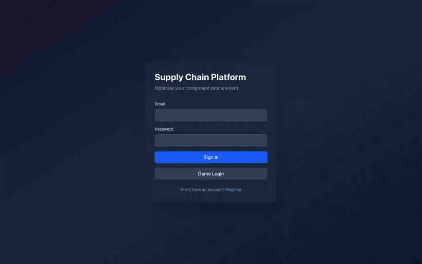
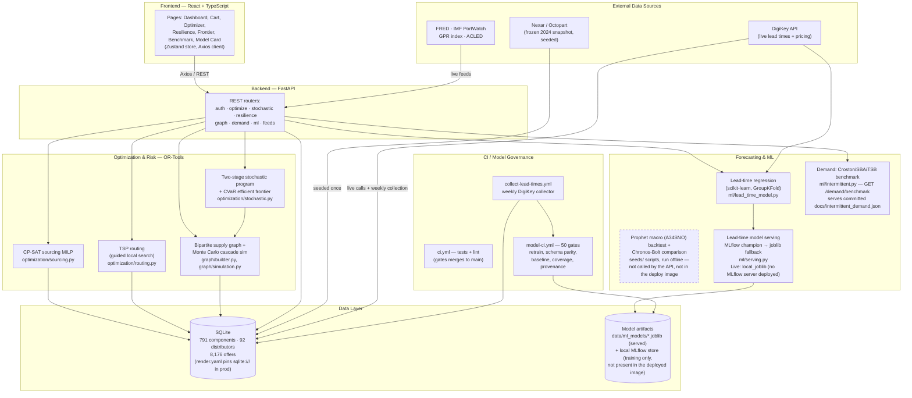
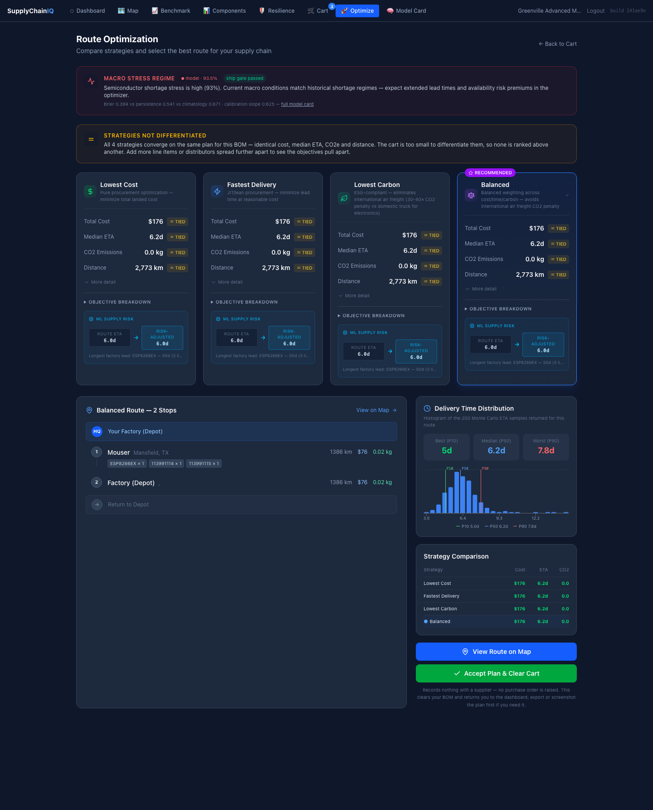
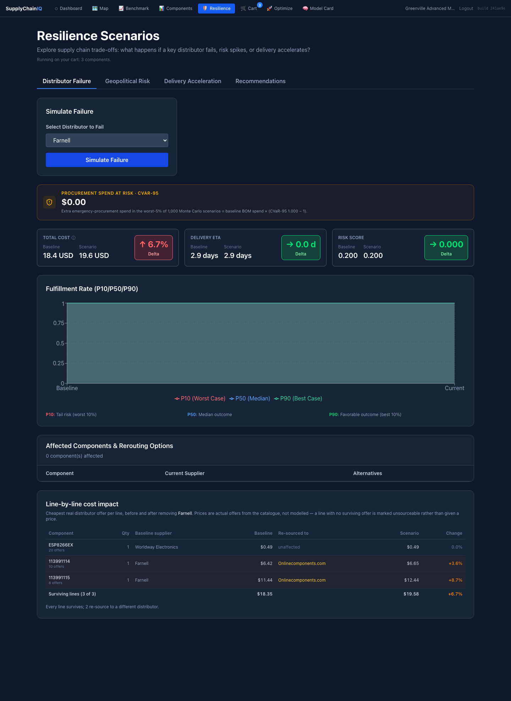

# Electronics Supply Chain Optimizer

[](https://github.com/ApagPlayz/supply-chain-optimizer/actions/workflows/ci.yml)

A full-stack supply chain intelligence platform for electronic component procurement. Built on real market data: **791 components, 92 distributors, 8,176 price offers** — a static 2024 snapshot originally collected via the Nexar API (which aggregates Octopart), redistributed on HuggingFace under CC-BY-4.0. It is real, but it is a **frozen snapshot, not a live feed** ([docs/DATA_PROVENANCE.md](docs/DATA_PROVENANCE.md)).

> ### ▶ Live demo — [supply-chain-ui-bhwz.onrender.com](https://supply-chain-ui-bhwz.onrender.com)
>
> API reference (Swagger): **[supply-chain-api-qy8x.onrender.com/docs](https://supply-chain-api-qy8x.onrender.com/docs)**
>
> No signup — the login page has a one-click **Demo Login** button.
> **Free-tier hosting: allow up to ~2 minutes for the first request while the backend wakes from sleep.** After that it responds in well under a second.

**Live demo flow:** Login → browse components → add to cart → run multi-objective VRP optimization → explore resilience scenarios.



*Recorded from the live deployment above — dashboard → add to cart → optimizer results → CVaR efficient frontier → resilience scenario. Static screenshots of each page are further down.*

---

## What it does

**For a PCB manufacturer sourcing a BOM of electronic components across 92 real distributors:**

| Feature | Technical approach |
|---------|-------------------|
| Supplier selection | CP-SAT MILP (OR-Tools) — minimize landed cost under stock/MOQ constraints |
| Route optimization | TSP with OR-Tools routing — PATH_CHEAPEST_ARC + Guided Local Search |
| 4 Pareto-distinct strategies | Multi-objective weighted sum (cost / time / carbon) — each provably distinct |
| Delivery uncertainty | Monte Carlo simulation (1,000 scenarios) → P10/P50/P90 ETA bands |
| Network fragility | Graph ML: Fiedler algebraic connectivity, betweenness centrality, HHI, k-core decomposition |
| Resilience scenarios | Distributor failure cascade, geopolitical risk overlay, delivery target optimization |
| Demand-method benchmark | Croston/SBA/TSB scored on CRPS + scaled pinball loss, not just MASE, across 2,646 Monash car-parts series — MASE and proper scoring pick different winners |
| Live risk feeds | GPR index, ACLED conflict data, IMF PortWatch port congestion, FRED freight indices |

---

## I audited my own headline and retracted it

The benchmark used to claim the optimizer was **44.7% cheaper than a greedy buyer**.
That number is arithmetically correct and substantively meaningless, so rather than
quietly deleting it, here is the decomposition.

The greedy baseline buys each BOM line from whoever is cheapest, which makes it the
**component-cost minimum by construction** — the MILP *cannot* beat it on component
cost. It can only win on fixed charges. And every distinct supplier you open costs a
flat **$75** (LTL) or **$150** (air) freight fee. Now look at the scale the benchmark
ran at:

| `iot_sensor_node`, as benchmarked (4 parts, 5 units) | |
|---|---:|
| Component cost | **$6.96** |
| Fixed freight fees | **$450.00** |
| Variable freight + consolidation | $11.02 |
| Total "landed cost" | $467.98 |

**Fixed fees are 96.2% of the cost being optimized.** Consolidating 3 suppliers into 1
avoids $337.50 of fees and books a "71.75% saving" — on a *seven-dollar* order.

Aggregated across all 10 BOMs (pooled: sum of greedy costs vs sum of MILP costs), the
decomposition is damning:

| Source of the $3,304 "saving" at benchmark scale | |
|---|---:|
| Avoided fixed per-supplier fees | **+$3,863** |
| Variable freight | +$2 |
| **Component cost** | **−$561** ← *the MILP pays **more** for the parts* |

**Fixed fees are 117% of the saving.** The MILP loses on component cost in **10 of 10**
BOMs — it must, since greedy is the component-cost minimum — and funds that loss, plus
the entire headline, out of avoided supplier fees.

That saving is a **constant** (`$112.50–$225 per supplier avoided`, after the 1.5×
`transport_penalty_scale`), not a rate — so as volume grows, only the denominator moves:

| Volume | Savings vs greedy (pooled) |
|---|---:|
| 4–9 units *(as benchmarked)* | **47.2%** |
| ~50 units | 23.1% |
| ~500 units | 8.5% |
| ~5,000 units | 5.0% |
| 2,000–60,000 units *(500×–10,000×)* | **2.6% – 8.0%** |

(`iot_sensor_node`, the BOM quoted at "71.75% saved", goes **71.7% → 7.4%** on its own.)

**The 45% headline is dead. Do not quote it.** At any volume a real manufacturer would
order, the cost edge is single digits.

### The audit found a real bug — and fixing it cut *against* the retraction

Chasing that decaying curve turned up a genuine defect in the freight model: it computed
one representative shipment weight for the whole BOM and then charged **every** opened
supplier that full weight, so splitting an order across 3 suppliers was billed 3× a full
BOM's variable freight instead of dividing one BOM's freight across 3 shipments. It
corrupted **both** arms (they share the cost function by design), and it made distance
almost free at volume.

Freight is now `fixed[d]·opened(d) + per_unit[d]·units_shipped_from(d)` — still linear,
so CP-SAT models it exactly. And the corrected model makes the optimizer look **better**
at scale, not worse: the fixed-fee wedge collapses to zero (at ≥500× the MILP opens
*more* suppliers than greedy on purpose), and the residual 3–8% edge comes from
**routing volume by price + freight** rather than by unit price alone — something greedy
structurally cannot do. That part scales with volume and is honestly earned.

Reporting a correction that helps my own number is the same discipline as reporting one
that hurts it.

What the optimizer genuinely provides beyond that: *feasibility and flexibility* — it
respects MOQ and stock (the greedy baseline cheerfully orders 2,500 units from an offer
holding 1), it can split a line across distributors, and it proves optimality on the
cost/time/carbon tradeoff.

Full decomposition, methodology and the reproduce script:
**[docs/BENCHMARK_VOLUME_CURVE.md](docs/BENCHMARK_VOLUME_CURVE.md)**.

> Auditing this also surfaced a genuine production bug: `sourcing.py` keyed its CP-SAT
> variables on `(component, distributor)` while the offer table stores one row per
> price-break tier, so 509 duplicated pairs were being summed into the demand constraint
> and priced into the objective. `STM32F103C8T6` from Verical was costed at **$30.03/unit
> against a true $2.86**, so the solver had been systematically avoiding multi-tier
> distributors. Fixed, with regression tests.

---

## Dollar-denominated impact

Every headline metric is paired with a concrete financial interpretation, derived
from real computed quantities — never an invented figure. The conversions are
surfaced live in the dashboard (resilience banner, benchmark strip, holding-cost
tooltips) and summarized here.

| Metric | Where it comes from | Dollar translation |
|--------|---------------------|--------------------|
| **CVaR-95** (tail-risk) | Mean emergency-procurement cost multiplier over the worst-5% of 1,000 Monte Carlo cascade scenarios (`graph/simulation.py`) | **"$X of procurement spend at risk"** = real baseline BOM spend × (CVaR-95 − 1). Computed per BOM in `resilience.py` (`procurement_spend_at_risk_usd`) and shown on the Resilience page; aggregated per reference BOM on the Benchmark page (`baseline_spend_at_risk_usd`). **Caveat — read this before trusting the number:** the *spend* side is real, and the *probability* side is now calibrated, not proxied. Distributor failure probability is anchored to a cited base rate — McKinsey Global Institute (Aug 2020): disruptions lasting a month or longer roughly every 3.7 years — converted to an annual Poisson rate and then to a probability over a 60-day purchase-order exposure window; betweenness centrality only rank-orders *relative* risk around that base rate (a `centrality_spread=1.0` sensitivity arm removes centrality's effect entirely), and every probability is capped at 50%. On the live headline BOM this puts calibrated `p_fail` between 2.25% and 13.04% — it no longer saturates near a fixed number. What's still assumed, not measured: the McKinsey rate is firm-level, so applying it to one distributor is almost certainly too high, and nothing establishes that centrality actually predicts disruption likelihood (the code names this and ships the `spread=1.0` arm precisely because of it). See [docs/CVAR_EFFICIENT_FRONTIER.md](docs/CVAR_EFFICIENT_FRONTIER.md). |
| **Optimizer cost delta** | Graph-aware vs baseline total landed cost across the 10 reference BOMs (`benchmark.py`) | **"$Y saved per BOM run"** = mean(graph-aware − baseline `total_cost_usd`). Computed live as `cost_delta_usd` and shown on the Benchmark page (negative = saved). Surfaced as a real, run-dependent figure rather than a fixed claim — on the current reference set the graph-aware delta sits near the ±2% noise floor, which the page labels honestly. |
| **Forecast WAPE** (macro backtest, kept) | Walk-forward backtest (3 rolling origins, 12-month horizon) on Census M3 `A34SNO` (Manufacturers' New Orders: Computers & Electronic Products), 198 monthly obs, **pinned to ALFRED vintage 2026-08-16**: Prophet **3.13%** vs seasonal-naive **4.80%** — skill score **+34.8%**. Under the **real-time protocol** — each origin trained only on the vintage that existed on its date, because Census revises this series *in place* — Prophet is **4.13%** vs naive **5.87%**, skill **+29.6%**. The revised-data figures are optimistic by ~24%; the real-time pair is the number you could actually have achieved, and it is the one to quote ([docs/FORECAST_BACKTEST.md](docs/FORECAST_BACKTEST.md)) | **No dollar translation.** This number used to feed a "≈N weeks of safety stock" tooltip on a per-part forecast — that forecast is gone (its magnitude was `total_stock/52 × risk_score`, inferred from inventory, not measured), and the safety-stock dollar figure went with it rather than being carried over with no live consumer. The macro WAPE above is real and stands on its own as a Prophet-vs-naive comparison on an aggregate industry series; it says nothing about per-part accuracy. **What now measures demand-forecast quality:** an intermittent-demand method benchmark on 2,646 Monash car-parts series — MASE ranks the degenerate `zero` forecast 1st (mean rank 1.66) while proper scoring ranks it 4th on CRPS / 5th on scaled pinball loss, and `tsb` wins both (Friedman p < 1e-300). See [docs/INTERMITTENT_DEMAND.md](docs/INTERMITTENT_DEMAND.md). That benchmark doesn't translate to dollars yet — connecting it to the sourcing decision is open work ([docs/archive/ML_API_PUSH_PLAN.md](docs/archive/ML_API_PUSH_PLAN.md) §1.4). |

### Conversion assumptions & citations

- **Inventory carrying cost = 25%/yr.** Reused from the existing optimizer constant
  `ANNUAL_HOLDING_RATE = 0.25` (`backend/app/optimization/costs.py`), cited to
  **Gartner IT Supply Chain Benchmarks 2022** (electronics annual holding rate). The
  same rate already drives the per-route holding cost shown at checkout. Industry
  ranges are typically 20–25%/yr (Richardson, *Harvard Business Review*; APICS).
- **Service level z = 1.645** (95%, one-sided normal) for the safety-stock buffer.
  WAPE is used as a σ/μ forecast-error proxy over the planning horizon — a standard
  textbook safety-stock framing (Silver, Pyke & Peterson, *Inventory Management and
  Production Planning*).
- **CVaR-95 → dollars: the spend side is real, and the probability side is now
  calibrated against a cited base rate — precisely which parts, and which parts
  are still assumed.** The *spend* side is real: it multiplies by the real BOM
  spend (sum of each line's average real offer price). The *probability* side
  (`optimization/stochastic.py`) starts from McKinsey Global Institute (Aug 2020):
  "companies can now expect supply chain disruptions lasting a month or longer to
  occur every 3.7 years," treated as a Poisson rate and converted to a probability
  over the 60-day purchase-order exposure window. Betweenness centrality
  (`graph/simulation.py`) only rank-orders *relative* risk around that calibrated
  base rate — the most central supplier gets `spread`× it, the least central gets
  1/`spread`×, capped at 50% — and `centrality_spread=1.0` (centrality ignored
  entirely) is a supported, published sensitivity arm. On the live headline BOM
  this gives calibrated `p_fail` of 2.25%–13.04% across the six suppliers, not a
  saturated constant. What's still an assumption, not a measurement: the McKinsey
  rate is firm-level, not per-supplier, so applying it to a single distributor is
  almost certainly too high; and nothing establishes that centrality actually
  predicts disruption likelihood at all (arguable either way — the code names this
  explicitly and ships the `spread=1.0` arm because of it). Earlier drafts of this
  README called the pre-calibration version "fully data-derived," which was an
  overstatement that was corrected; this is the current, calibrated state.

### What this model can't do

Stated up front, because an interviewer will find these anyway and it is better that
they hear it from me:

- **There is no per-part demand forecast in this app, and there wasn't a good one
  before.** It used to compute `total_stock / 52 × risk_score` and call the result
  "demand," then fit Prophet on top — a magnitude *inferred from inventory position
  and a risk multiplier*, not measured, and identical in shape across all 791 parts.
  The forecast window it produced also closed 17 months before this line was
  written, against which no actuals were ever recorded — unscoreable even in
  principle. It was removed rather than patched (migration
  `0008_drop_synthetic_demand_tables.py`), because no public per-SKU demand series
  exists for electronic components. The Census `A34SNO` backtest above is real and
  unaffected by the deletion — it never depended on those tables — but it measures
  an aggregate industry series, not this app's parts, so the 3.13% WAPE (4.13%
  under the real-time protocol) is still not evidence about per-part accuracy.
  What replaced the per-part claim is a method
  benchmark on a real intermittent-demand panel (Monash car parts) — see the
  demand-method row above and [docs/INTERMITTENT_DEMAND.md](docs/INTERMITTENT_DEMAND.md).
- **Disruption probabilities are structural, not empirical** (see the CVaR caveat above).
- **The lead-time panel is 1,922 real observations across four snapshot dates**
  (75 on 2026-07-01, 742 on 2026-08-15, 363 on 2026-08-17, 742 on 2026-08-24), all from DigiKey — one
  distributor, not a cross-distributor consensus. 791 of 791 parts were polled on
  2026-08-15; 6.2% missed (43 not in DigiKey's catalog, 6 in the catalog with no
  published lead time), and that miss list is in
  `seeds/data/lead_time_panel/collection_log.csv`. The served model is fitted on
  1,879 of those rows (`GET /api/v1/ml/model-info` publishes the count).
- **Any lead-time R² must come from a *grouped* split, not a random one.** The dataset
  contains large near-duplicate part families (100 STM32F103 variants, 37 ATMEGA328),
  and `base_product` alone explains **R²=0.82 of the target in sample** (360 levels
  over 810 rows). A random split therefore scores memorization of a part family, not
  prediction. Measured over 50 folds — same estimator, same rows, only the grouping
  changes (the study was run on the 810 trainable rows of the two-snapshot, 817-row
  vintage of the panel; the panel has since grown to 1,922 rows and the study has
  not been re-run — the committed numbers below are the ones from that vintage):

  | Split regime | R² mean | R² median |
  |---|---:|---:|
  | random rows (**the wrong protocol**) | **+0.638** | +0.638 |
  | `GroupKFold` by part family (`base_product`) | **+0.082** | +0.163 |
  | `GroupKFold` by manufacturer | **−0.550** | −0.166 |

  The effective sample size for generalization is **27 manufacturers, not 810 rows**.
  A negative R² on held-out manufacturers means the model's squared error exceeds
  that vendor's whole label variance — no explanatory power at all on a vendor it has
  never quoted. Grouped by `base_product` is the only split I would defend, and even
  that one is optimistic relative to how the model is deployed. Full protocol,
  per-fold scores and the naive baselines on identical folds:
  [docs/LEAKAGE_PROGRESSION.md](docs/LEAKAGE_PROGRESSION.md) /
  [docs/leakage_progression.json](docs/leakage_progression.json), regenerated with
  `cd backend && python -m seeds.run_leakage_progression`.
- **Prices are a frozen 2024 snapshot**, so nothing here reflects today's market.

See [docs/IMPACT_FRAMING.md](docs/IMPACT_FRAMING.md) for the full derivations.

---

## Quick Start (no Docker required)

Nothing to install if you just want to look: use the **[live demo](https://supply-chain-ui-bhwz.onrender.com)** above.
To run it locally, see **[QUICK_START.md](QUICK_START.md)** for step-by-step setup.

**TL;DR:**
```bash
# Terminal 1 — backend
cd backend && source venv/bin/activate
python -m uvicorn app.main:app --reload --port 8000

# Terminal 2 — frontend
cd frontend && npm run dev
```

Open http://localhost:5173 → click **Demo Login**.

---

## Tech Stack

**Backend:** Python 3.11 · FastAPI · SQLAlchemy · SQLite (dev **and** current production — `render.yaml` pins `DATABASE_URL=sqlite:///./supply_chain.db`; PostgreSQL support exists in the SQLAlchemy layer via `psycopg`, but nothing is deployed on it) · OR-Tools · NetworkX · scikit-learn (Prophet is installed and used by the offline `seeds/` backtests; no API route imports it)  
**Frontend:** React 18 · TypeScript · Vite · Tailwind CSS · Recharts · Zustand  
**Algorithms:** CP-SAT MILP, TSP, Monte Carlo simulation, Spectral Graph Theory  
**Data:** Nexar/Octopart static 2024 snapshot (real component pricing), DigiKey API (1,922 real observed lead times + live pricing), Nexar & OEMsecrets live pricing, FRED, IMF PortWatch, GPR index (all live), ACLED (needs a key — reports as inactive without one)

---

## Architecture

```
frontend/src/
  pages/          Dashboard, Map, Scheduler, Cart, Checkout, Resilience, Benchmark, ModelCard, Login, Register
  components/     ScenarioCard, MonteCarloChart, BOMImpactTable, DeltaCard, NavBar
  store/          Zustand: authStore, cartStore, optimizeStore
  services/api.ts Axios client for all backend endpoints

backend/app/
  api/            FastAPI routers: auth, cart, optimize, resilience, graph, feeds, demand
  optimization/   CP-SAT sourcing MILP, OR-Tools TSP, cross-dock facility location
  graph/          NetworkX bipartite supply graph, Fiedler curve, centrality metrics
  feeds/          Live data fetchers: GPR, ACLED, IMF PortWatch, FRED freight
  ml/             Prophet macro (A34SNO) backtest + Chronos comparison, sklearn lead-time
                  prediction, FRED regime model, intermittent-demand method benchmark
                  (Croston/SBA/TSB, shared rolling-origin protocol)
  cache.py        SHA256-keyed scenario cache, 1h TTL, background cleanup
  supply_chain.db SQLite — 791 components, 92 distributors, 8,176 price offers (real data)
```


```mermaid
flowchart TB
    subgraph FE["Frontend — React + TypeScript"]
        UI["Pages: Dashboard, Cart, Optimizer,<br/>Resilience, Frontier, Benchmark, Model Card<br/>(Zustand store, Axios client)"]
    end

    subgraph BE["Backend — FastAPI"]
        API["REST routers:<br/>auth · optimize · stochastic · resilience<br/>graph · demand · ml · feeds"]
    end

    subgraph OPT["Optimization & Risk — OR-Tools"]
        SOURCING["CP-SAT sourcing MILP<br/>optimization/sourcing.py"]
        ROUTING["TSP routing<br/>(guided local search)<br/>optimization/routing.py"]
        STOCH["Two-stage stochastic program<br/>+ CVaR efficient frontier<br/>optimization/stochastic.py"]
        GRAPHSIM["Bipartite supply graph +<br/>Monte Carlo cascade sim<br/>graph/builder.py, graph/simulation.py"]
    end

    subgraph ML["Forecasting & ML"]
        LEADTIME["Lead-time regression<br/>(scikit-learn, GroupKFold)<br/>ml/lead_time_model.py"]
        DEMAND["Demand: Croston/SBA/TSB benchmark<br/>ml/intermittent.py — GET /demand/benchmark<br/>serves committed docs/intermittent_demand.json"]
        OFFLINE["Prophet macro (A34SNO) backtest +<br/>Chronos-Bolt comparison<br/>seeds/ scripts, run offline —<br/>not called by the API, not in the deploy image"]
        SERVING["Lead-time model serving<br/>MLflow champion → joblib fallback<br/>ml/serving.py<br/>Live: local_joblib (no MLflow server deployed)"]
    end

    subgraph DATA["Data Layer"]
        DB[("SQLite<br/>791 components · 92 distributors<br/>8,176 offers<br/>(render.yaml pins sqlite:/// in prod)")]
        ARTIFACTS[("Model artifacts<br/>data/ml_models/*.joblib (served)<br/>+ local MLflow store (training only,<br/>not present in the deployed image)")]
    end

    subgraph EXT["External Data Sources"]
        NEXAR["Nexar / Octopart<br/>(frozen 2024 snapshot, seeded)"]
        DIGIKEY["DigiKey API<br/>(live lead times + pricing)"]
        MACRO["FRED · IMF PortWatch<br/>GPR index · ACLED"]
    end

    subgraph CICD["CI / Model Governance"]
        CI["ci.yml — tests + lint<br/>(gates merges to main)"]
        MODELCI["model-ci.yml — 50 gates<br/>retrain, schema parity,<br/>baseline, coverage, provenance"]
        COLLECTOR["collect-lead-times.yml<br/>weekly DigiKey collector"]
    end

    UI -->|Axios / REST| API
    API --> SOURCING
    API --> ROUTING
    API --> STOCH
    API --> GRAPHSIM
    API --> LEADTIME
    API --> DEMAND
    STOCH --> GRAPHSIM
    SOURCING --> DB
    ROUTING --> DB
    GRAPHSIM --> DB
    API --> DB
    LEADTIME --> SERVING
    SERVING --> ARTIFACTS
    NEXAR -->|seeded once| DB
    DIGIKEY -->|live calls + weekly collection| DB
    DIGIKEY --> LEADTIME
    MACRO -->|live feeds| API
    COLLECTOR --> DB
    COLLECTOR --> MODELCI
    MODELCI --> ARTIFACTS

    classDef offline stroke-dasharray: 5 5;
    class OFFLINE offline;
```

Every ML training run is tracked with MLflow (params, real backtest metrics, model artifacts, champion promotion) — see [docs/MLFLOW.md](docs/MLFLOW.md).

---

## Screenshots

| VRP Optimization (4 strategies) | Resilience Dashboard |
|---|---|
|  |  |

---

## Key API Endpoints

```
POST /api/v1/auth/demo                       # one-click demo login
GET  /api/v1/components                      # 791 real electronic components
POST /api/v1/optimize/vrp                    # 4-strategy VRP: cheapest/fastest/greenest/balanced
GET  /api/v1/graph/metrics                   # Fiedler value, centrality, HHI, k-core
POST /api/v1/resilience/distributor-failure  # simulate distributor outage -> cost/ETA/risk delta
POST /api/v1/resilience/geopolitical-risk    # overlay GPR spike -> affected components
POST /api/v1/resilience/delivery-target      # "who can hit 14 days?" -> supplier capability list
GET  /api/v1/demand/benchmark                 # intermittent-demand method benchmark (Croston/SBA/TSB, CRPS+MASE, Monash car parts)
GET  /api/v1/feeds/status                    # live feed status: GPR, ACLED, PortWatch, FRED
GET  /api/v1/benchmark/summary               # network resilience metrics snapshot
```

Full API reference (live Swagger UI): **https://supply-chain-api-qy8x.onrender.com/docs** — or http://localhost:8000/docs when running locally  
Scenario API reference: [docs/archive/SCENARIO_API.md](docs/archive/SCENARIO_API.md)

---

## Tests

```bash
cd backend
source venv/bin/activate
pytest tests/ -q
# -> 765 passed, 2 skipped, 1 failed
```

The 1 failure (`test_the_served_estimator_is_the_one_the_metrics_describe`) is a
documented local-environment artifact: it depends on which MLflow store/model
identity resolves at import time on the machine running the suite, and it passes
in CI. It is not a passing suite end to end on every machine, and this note says so
rather than rounding it off.

Test coverage (backend): optimization solver (sourcing, routing, cross-dock), graph metrics, ML models, resilience API, auth guards, feed integrations. The frontend has no automated test suite — it is verified by type-checking (`tsc --noEmit`), a production build, and manual screenshot review.

---

## Model CI — gates derived from bugs that actually shipped

A second workflow, [`model-ci`](.github/workflows/model-ci.yml), asks a different
question from `ci.yml`: not *"does the code work?"* but *"is the model fit to
serve?"*. It retrains the lead-time model on the committed observed panel and
fails the build on any of the following. **Every gate is a postmortem, not a best
practice** — each one names a defect that was live in this repo and was found by
hand, never by a test:

| Gate | The bug it prevents |
| --- | --- |
| **Train/serve schema parity** | Training and serving built different feature schemas; the aligner zero-filled the difference, so **every** prediction was the constant 62.1085 days — while `/ml/model-comparison` published R²=0.9291 for a configuration that was never served. |
| **Beats its stated baseline** | `beats_baselines` was computed and the model was persisted regardless of the answer. The regime model shipped at 0.733 accuracy against a 0.833 persistence baseline. Now a losing model is refused *and* any stale artifact is deleted. |
| **Serve-time coverage floor** | Feature admission asked "does this column exist?" instead of "is it ever populated?". Two columns filled on 7.0% of rows were admitted, and the model then declined to predict on 93% of real inputs — false on 6 of 6 sampled optimizer runs. Now ≥80% of real `(offer, component)` pairs must get an answer, measured against the shipped database. |
| **Not a near-constant predictor** | The other half of the schema bug, and the reason it survived: nothing ran the committed artifact over real inputs and measured the spread. Now it does. |
| **Endpoint declares its model's inputs** | The schema grew a `parameter_count` requirement, the `/ml/lead-time` signature did not follow, and FastAPI returned **422 on every call** before the model was consulted. |
| **Artifact carries provenance** | `metrics.joblib` had no `trained_at`, no training-data hash, no row count, no git SHA — so which data produced which model was unanswerable, which is why the R² mismatch went unnoticed. |
| **A gate can't silently stop testing** | A contract test kept passing while testing nothing, because the primary feature was renamed underneath it. Meta-tests now assert the variance tests still vary the model's *actual* primary feature — and `MODEL_CI_STRICT=1` turns a **skipped** gate into a failure, because a skipped gate is a green gate. |

Provenance (`trained_at`, `git_sha`, `sklearn_version`, `training_data_sha256`,
`n_training_rows`, `n_distinct_families`, …) is stamped at fit time and published
at `GET /api/v1/ml/model-info`. A **staleness check** warns — never fails — when
the weekly collector has grown the panel past what the served artifact was
trained on, so that growth is visible rather than silently ignored.

```bash
cd backend
MODEL_CI_STRICT=1 pytest tests/ -m model_ci -v   # -> 50 gates
```

Full write-up, including what these gates deliberately do **not** claim:
**[docs/MODEL_CI.md](docs/MODEL_CI.md)**.

---

## Lint & type-check

CI runs a dedicated `backend-lint` job (ruff + mypy) alongside tests, plus `tsc -b`
for the frontend (part of `npm run build`). Config lives in `backend/pyproject.toml`.

```bash
cd backend
source venv/bin/activate
pip install -r requirements-dev.txt   # ruff + mypy, dev-only

ruff check app          # lint (E/F/I/UP/B core rules)
ruff format app --check # formatting — not yet wired into CI (see note below)
mypy app                 # type-check (non-strict)
```

Both `ruff check app` and `mypy app` are green today. Deliberately deferred, tracked
in `pyproject.toml` comments so they can be picked up later without fighting
in-flight edits elsewhere in the repo:

- **`ruff format`**: ~63 of 71 backend files would be reformatted (the codebase
  predates a formatter convention). Not added as a CI gate yet — running it would
  touch nearly every file. Run locally and land as its own PR when convenient.
- **Typing-modernization rules** (`UP006`, `UP035`, `UP037`, `UP045` — `List`/`Optional[X]`
  → `list`/`X | None`) and **import sorting** (`I001`): large, repo-wide, low-risk-but-
  noisy sweeps. Ignored in `[tool.ruff.lint]` for now; safe to re-enable and `--fix`
  once other in-flight branches land.
- **A handful of per-file rule ignores** in `app/ml/regime_model.py`, `app/ml/lead_time_model.py`,
  `app/optimization/recommendations.py`, `app/optimization/solve.py`,
  `app/optimization/sourcing.py`, `app/graph/simulation.py`,
  `app/core/clients/oemsecrets_client.py` — small, real lint findings (unused imports/vars,
  `zip()` without `strict=`, an unused loop variable) left untouched because those files
  are owned by concurrent work; see `[tool.ruff.lint.per-file-ignores]`.
- **mypy** is fully strict-by-default-off (`ignore_missing_imports`, no `--strict`) and
  has a `[[tool.mypy.overrides]]` block that turns off checking for ~22 modules — mostly
  `app/api/*` and `app/optimization/*` — where the codebase's untyped SQLAlchemy
  `Column(...)` declarative models (no `Mapped[...]` annotations) produce large numbers
  of `Column[T]` vs `T` false positives rather than real bugs. ~50 modules are fully
  type-checked today. Migrating `app/models/*` to SQLAlchemy 2.0 `Mapped[]` typing would
  let those overrides be removed.

---

## Interview Narrative

See [docs/RESILIENCE_INTERVIEW_GUIDE.md](docs/RESILIENCE_INTERVIEW_GUIDE.md) for the full demo walkthrough and talking points.

**The 30-second pitch:**

> "Supply chain resilience is a graph problem, so I measured it spectrally — and the
> measurement talked me out of my own thesis. I expected one dominant distributor and a
> network one failure from collapse. What the data actually says: DigiKey is the largest
> single distributor at **11.2%** of offers, not 40%; killing DigiKey outright orphans
> **zero** components and moves landed cost by **~0%**, because the per-line redundancy
> is genuinely there. The whole-graph Fiedler value is exactly 0.0 — but that's a floor
> by construction, since the graph fragments into 43 components. The number that means
> something is λ₂ = **0.238** on the giant component, which holds **95%** of the network:
> moderately connected, not fragile. The real single-point risk is the other 5% — the
> parts with no path into the main network at all. That's the list worth acting on."

*(An earlier version of this pitch claimed "DigiKey handles 40% of offers" and "12
components have no alternative source." Neither is true of this data. They are left
documented here rather than quietly deleted, because catching it is the more
interesting story than never having written it.)*

**Key talking points:**
- Fiedler value as a fragility metric — including *why the naive whole-graph reading of it is a trap* on a disconnected graph
- Monte Carlo shows distribution tails, not just means — that's where supply chain risk lives
- CP-SAT produces 4 Pareto-distinct strategies because cost, time, and carbon are not scalar multiples of each other
- Live geopolitical data overlay: GPR/PortWatch/FRED feeds inform the optimizer (ACLED is wired but needs a key — the UI labels it "Inactive" rather than faking a healthy feed)

---

## How this was built

Most of the code in this repo was written by AI agents — Claude, running under
`.github/workflows/claude-*.yml` — not by me typing it line by line. I'm not going to
pretend otherwise; the workflows are public, and so is `LEARNINGS.md`.

What I actually did: framed the problem, decided what to build and in what order,
reviewed every pull request before merging it, and did the verification — including the
audit above that found the 44.7% headline was arithmetically real and substantively
meaningless, and killed it rather than leaving it in. That retraction is the clearest
evidence of what "direction" means here: an agent produced the number, and I'm the one
who checked it, didn't like what I found, and published the correction instead of the
headline.

There's also an autonomous loop running on a schedule — Scout files proposals, Builder
opens PRs against them, an independent Auditor reviews each one, and I'm the only one who
can merge to `main` (see `docs/archive/AUTONOMOUS-LOOP.md`). `LEARNINGS.md` exists because early
runs of that loop failed in ways a green checkmark didn't catch — a run that filed zero
issues and still reported success, subagents that got killed mid-task when their parent
job ended. It's a record of what already went wrong, kept so it doesn't happen twice.

Nothing in this README is asserted on trust. The optimizer and ML numbers are checked by
CI gates (`model-ci`, [docs/MODEL_CI.md](docs/MODEL_CI.md)) that fail the build rather
than let a bad number ship quietly.

---

## Data Sources

| Source | What it provides |
|--------|-----------------|
| Nexar / Octopart (**static 2024 snapshot**, via HuggingFace `mdnh/electronic-components-supply-chain`, CC-BY-4.0) | Real component pricing, stock levels, distributor offers (791 components, 92 distributors, 8,176 offers). Real data, but a **frozen snapshot** — not a live API feed. See [docs/DATA_PROVENANCE.md](docs/DATA_PROVENANCE.md). |
| DigiKey API (**live**) | **1,922 real observed lead times across four snapshots** (75 on 2026-07-01, 742 on 2026-08-15, 363 on 2026-08-17, 742 on 2026-08-24), collected from all 791 catalogued components — 6.19% miss rate on the full 2026-08-15 sweep, logged per attempt. Collected by [`app/ml/lead_time_collector.py`](backend/app/ml/lead_time_collector.py) (resumable, quota-aware, honours `X-RateLimit-Remaining` and `Retry-After`) and scheduled weekly via [`.github/workflows/collect-lead-times.yml`](.github/workflows/collect-lead-times.yml). Also supplies live pricing/stock through `/api/v1/live-prices/*`. |
| FRED (Federal Reserve) | Freight index, PPI, macro stress regime |
| ACLED | Conflict event counts by country (distributor risk) |
| IMF PortWatch | Port call frequency (congestion delay) |
| GPR Index | Geopolitical risk index (Chinese-origin component risk) |

---

## License

MIT
